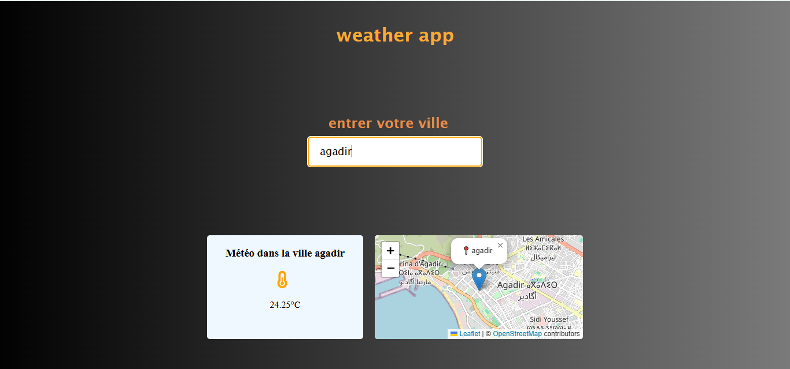
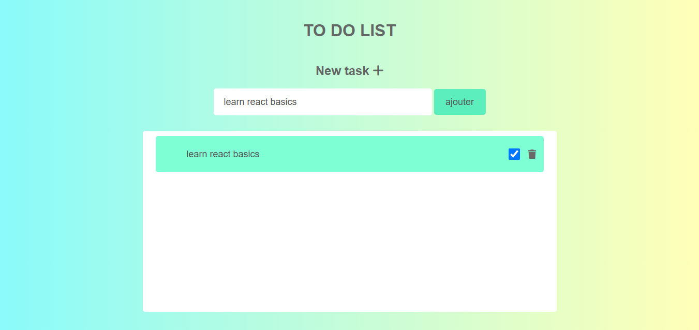

# 🎓 Mini Web Projects — Learning the Basics

## 🌍 About

This repository gathers a collection of small web projects I created while learning the fundamentals of **web development (HTML, CSS, and JavaScript)**.  
Each folder contains an independent mini-project 
These exercises helped me practice **page structure**, **layout design**, and **basic interactivity**.

<br/>

## 📁 Repository Structure

| # | Project Name          | Description                                              | Technologies              |
|---|----------------------|----------------------------------------------------------|---------------------------|
| 1 | Weather App           | Displays the weather of a city and its location on the map | HTML, CSS, JavaScript     |
| 2 | Simple To-Do List     | Easily add, complete, or delete tasks                   | HTML, CSS, JavaScript     |
| 3 | Simple Landing Page   | A simple landing page to showcase a project or product  | HTML, CSS, JavaScript     |

<br/>

## 📸 Applications Preview

### Weather App
<p align="center">
  
  </p>

  <br/>
  
### Simple To-Do List 
<p align="center">
  
  </p>

  <br/>
    
### Simple Landing Page 
<p align="center">
  
  </p>

  <br/>


## 🚀 How to Run a Project

1. **Clone this repository:**

```bash
git clone https://github.com/your-username/mini-web-projects.git
```
2. **Navigate** to the project folder you want to view:
```bash
cd mini-web-projects/project-name
```
3. **Open** the project in your browser:
 
